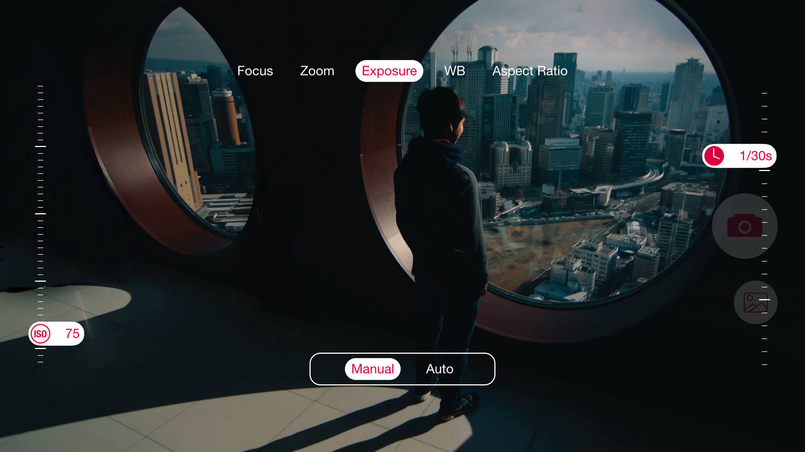
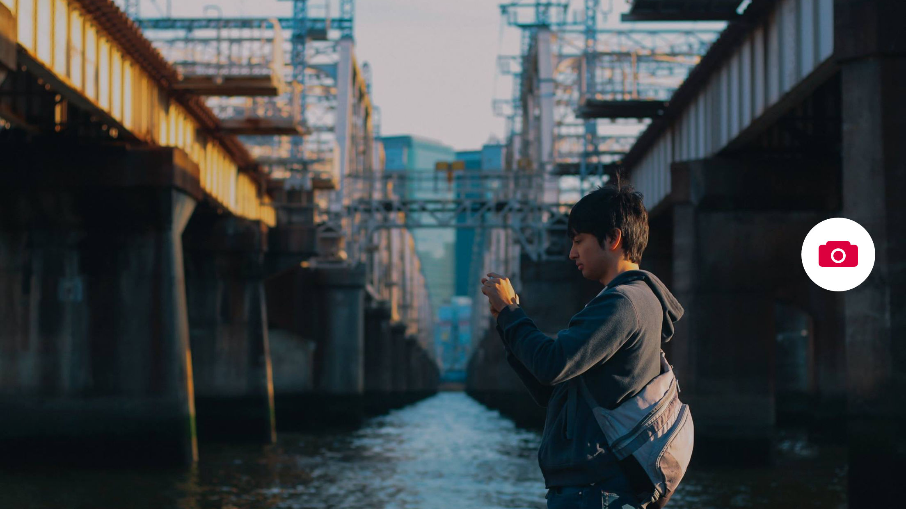
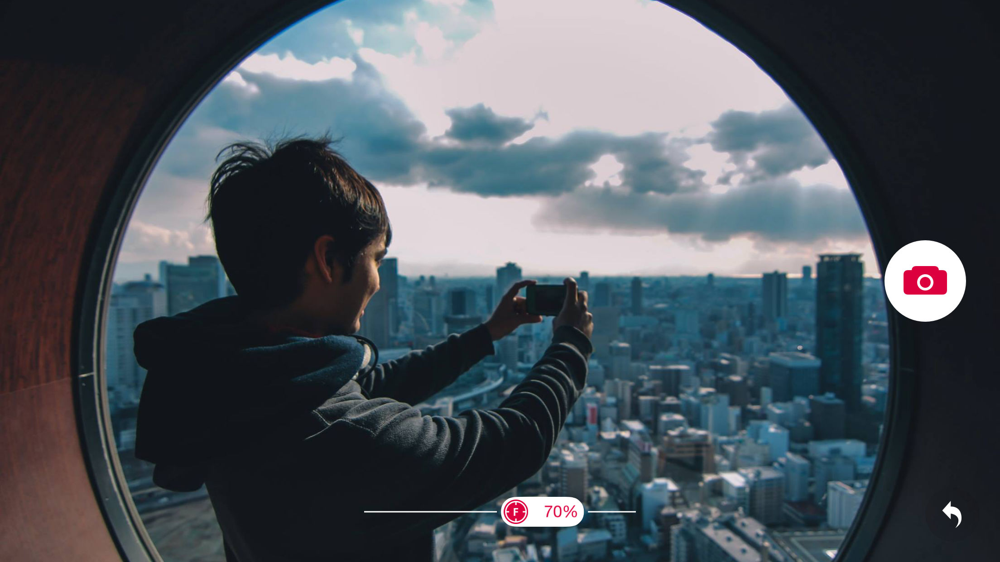

# Manual Capture
Manual Capture is an app made with the intention of getting people to discover their inner photographer. Designed to give users a sense of space, the app makes composition natural and fun.

Being at the right place at the right time is a big part of taking good photos. What Manual Capture is designed to do is to be simple, quick to use, and convenient enough to be able to capture the precious moments that go by so soon while also being advanced enough to let users give their photos a personal touch. The controls for focus, exposure time, ISO, as well as white balance can be adjusted with one gesture of your thumb.

You will love photography with this app!
### App Preview
https://www.youtube.com/watch?v=T7SEg0kjIJk
### Screenshots

